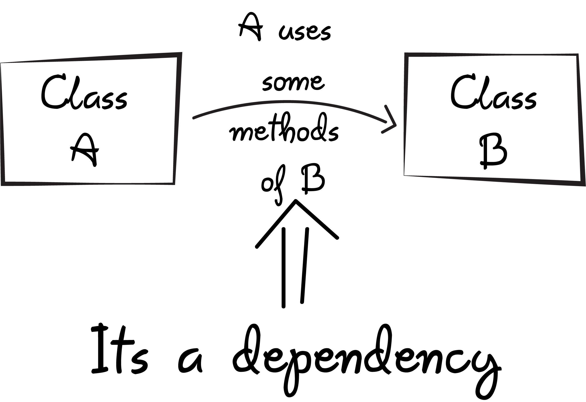

# Dependency Injection

[https://dev.to/azure/dependency-injection-in-javascript-101-2b1e](https://dev.to/azure/dependency-injection-in-javascript-101-2b1e) 

Dependency Injection is...

Dependency Inversion...

The "container" is a place to store a key value pair of all of the classes we want to instantiate

